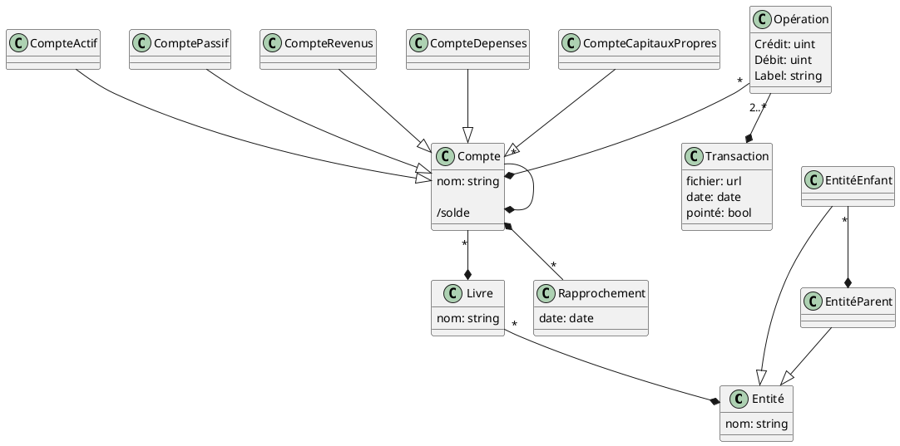

# Modèle conceptuel

Représenté et éditable sur le pad : https://md.picasoft.net/h8vvzYGWSmSiZBVJsDC2OQ?both

```plantuml
@startuml

'Classes

class Entité {
    nom: string
}

class Livre {
    nom: string
}

class EntitéParent
class EntitéEnfant

class Compte {
    nom: string

    /solde
}

class CompteActif
class ComptePassif
class CompteRevenus
class CompteDepenses
class CompteCapitauxPropres

class Transaction{
    fichier: url
    date: date
    pointé: bool
}

class Rapprochement {
    date: date
}

class Opération {
    Crédit: uint
    Débit: uint
    Label: string
}

' Héritages

EntitéParent --|> Entité
EntitéEnfant --|> Entité

CompteActif --|> Compte
ComptePassif --|> Compte
CompteRevenus --|> Compte
CompteDepenses --|> Compte
CompteCapitauxPropres --|> Compte

' Associations

Opération "2..*" --* Transaction
Opération "*" --* Compte
EntitéEnfant "*" --* EntitéParent
Compte "*" --* Compte
Livre "*" --* Entité
Compte "*" --* Livre

Compte *-- "*" Rapprochement

@enduml
```
