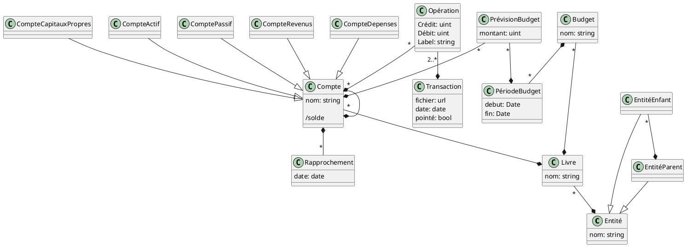

# Modèle conceptuel

Représenté et éditable sur le pad : https://md.picasoft.net/h8vvzYGWSmSiZBVJsDC2OQ?both



## Modèle logique

Les attributs marqués `#` sont des attributs clés de la relation.

Pour l'entité, on peut raisonnablement supposer que le nom est unique.
```
Entité (
    #nom : string unique
    parent => Entité nullable
)
```

Le livre est identifié par le nom au sein d'une entité (une entité ne peut pas avoir deux livres du même nom).
```
Livre (
    #nom : string unique
    #entite => Entité
)
```

Un compte ne peut pas avoir deux enfants du même nom. Le livre fait également partie de la clé pour pouvoir reproduire les schémas de comptes entre plusieurs livres.
```
Compte (
    #nom : string
    #parent => Compte nullable
    type : {Actifs, Passifs, Revenus, Dépenses, CapitauxPropres}
    #livre => Livre
)
```

Une opération ne fait pas intervenir plusieurs fois le même compte dans la même transaction.
```
Opération (
    crédit : uint
    débit : uint
    label : string nullable
    #compte => Compte
    #transaction => Transaction
)
```

Il n'y a pas d'identifiant spécifique pour une transaction.
```
Transaction (
	#id : int autoincrement
    date : Date
    pointé : bool
    fichier : url / fichier
)
```

On ne peut pas rapprocher plusieurs fois le même compte à la même date.
```
Rapprochement (
    #compte => Compte
    #date : Date
)
```
