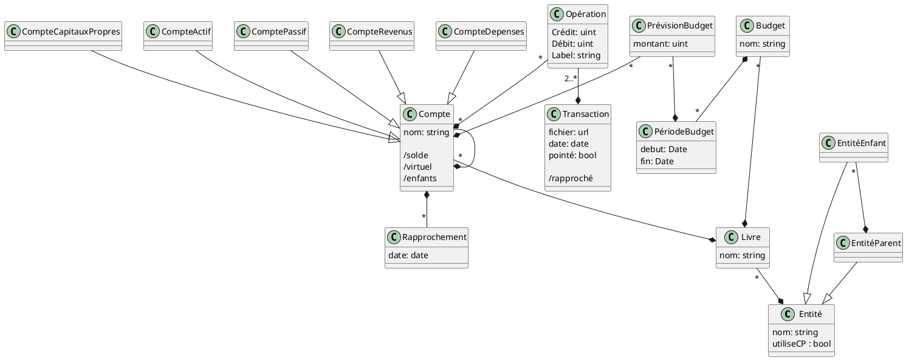

# Modèle conceptuel

Représenté et éditable sur le pad : https://md.picasoft.net/h8vvzYGWSmSiZBVJsDC2OQ?both



## Modèle logique

Les attributs marqués `#` sont des attributs clés de la relation.

Pour l'entité, on peut raisonnablement supposer que le nom est unique.
```
Entité (
    #nom : string unique
    utiliseCP : bool
    parent => Entité nullable
)
```

Le livre est identifié par le nom au sein d'une entité (une entité ne peut pas avoir deux livres du même nom).
```
Livre (
    #nom : string unique
    #entite => Entité
)
```

Un compte ne peut pas avoir deux enfants du même nom. Le livre fait également partie de la clé pour pouvoir reproduire les schémas de comptes entre plusieurs livres.
On notera également qu'un compte a soit un parent, soit un livre mais pas les deux : le livre fait office de compte racine.
```
Compte (
    #nom : string
    type : {Actifs, Passifs, Revenus, Dépenses, CapitauxPropres}
    #parent => Compte nullable
    #livre => Livre nullable
)
```

Une opération ne fait pas intervenir plusieurs fois le même compte dans la même transaction.
Une opération doit respecter `(crédit != 0) XOR (débit != 0)`. Les deux champs ne sont pas `nullable`, on leur mettra une valeur par défaut à 0.
```
Opération (
    crédit : uint
    débit : uint
    label : string nullable
    #compte => Compte
    #transaction => Transaction
)
```

Il n'y a pas d'identifiant spécifique pour une transaction, on met une clé artificielle.
On notera qu'une transaction doit être équilibrée avant d'être validée en base.
```
Transaction (
    #id : int autoincrement
    date : Date
    pointé : bool
    fichier : url / fichier nullable
)
```

On ne peut pas rapprocher plusieurs fois le même compte à la même date.
```
Rapprochement (
    #compte => Compte
    #date : Date
)
```
