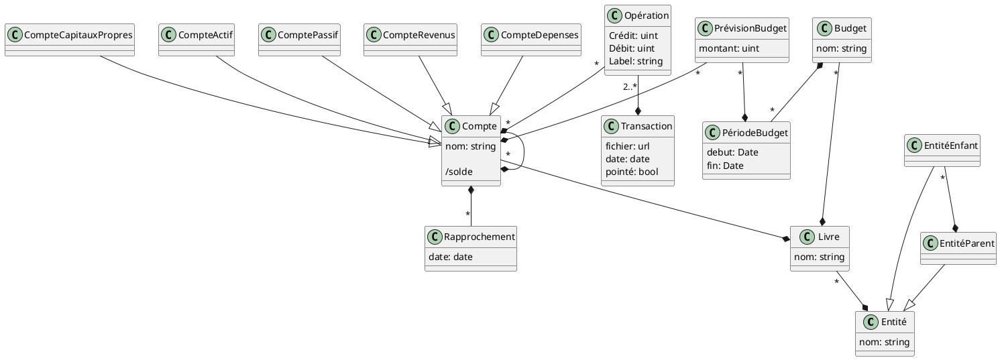

# Modèle conceptuel

Représenté et éditable sur le pad : https://md.picasoft.net/h8vvzYGWSmSiZBVJsDC2OQ?both



## Modèle logique

Les attributs marqués `#` sont des attributs clés de la relation.

```
Entité (
    #nom : string unique ?
    parent => Entité nullable
)

Livre (
    #nom : string unique ?
    #entite => Entité
)

Compte (
    #nom : string
    parent => Compte(id) nullable
    type : {Actifs, Passifs, Revenus, Dépenses, CapitauxPropres}
    #livre => Livre
)

Opération (
    crédit : uint
    débit : uint
    label : string
    compte => Compte
    transaction => Transaction
)

Transaction (
    date : Date
    pointé : bool
    fichier : url / fichier
)

Rapprochement (
    #compte => Compte
    #date : Date
)
```
